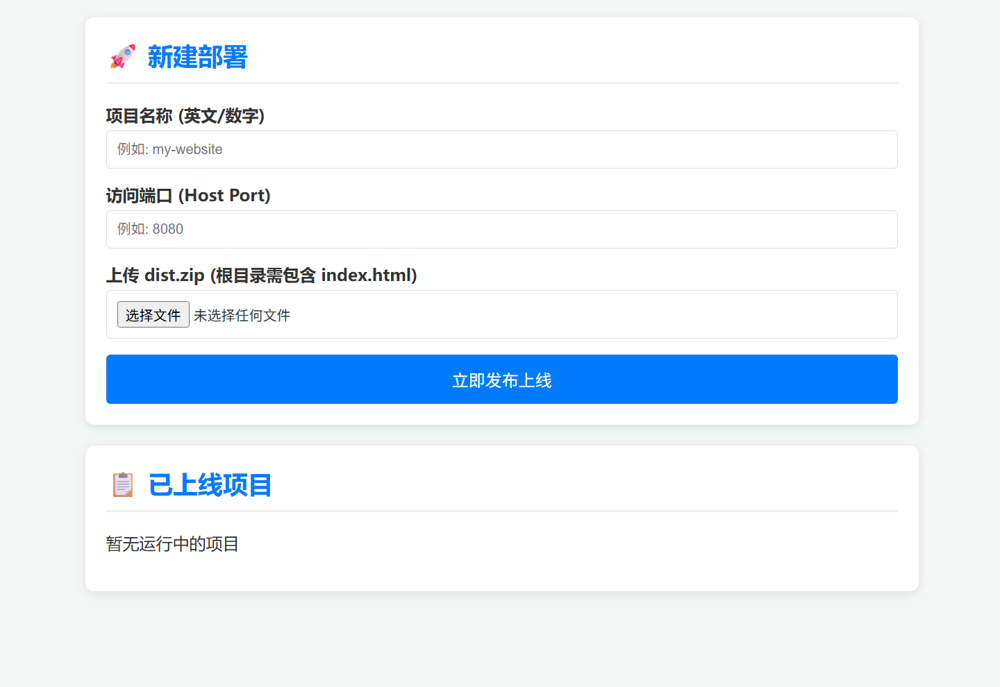

# 🚀 Frontend Deployer (轻量前端一键部署助手)

**Frontend Deployer** 是一个轻量级前端部署管理工具。它通过 Node.js 控制宿主机 Docker，实现前端压缩包（`.zip`）的自动解压、目录平铺归一化、以及 Nginx 容器化发布。

## 📸 页面效果



---

## ✨ 核心特性

- **智能目录兼容**：自动识别并修复 `.zip` 包中嵌套 `dist` 文件夹的问题，确保 `index.html` 始终处于 Nginx 根目录。
- **环境隔离**：管理后台运行在 Docker 容器中，完美绕过 CentOS 7 系统 GLIBC 版本过低无法安装高版本 Node.js 的难题。
- **精准管理**：通过 Docker Label (`managed-by=frontend-deployer`) 技术，管理界面仅显示由本系统部署的项目，不干扰宿主机其他服务。
- **API 转发**：支持为部署的项目配置反向代理，将指定前缀（如 `/api`）的请求转发到后端服务，解决前后端分离项目的跨域和部署问题。
- **极简操作**：上传、填写端口、点击部署，三步完成上线。

---

## 📁 项目结构

```
.
├── docker-compose.yml      # Docker Compose 配置文件
├── Dockerfile              # 管理后台容器构建文件
├── index.html              # 前端管理界面
├── server.js               # 后端核心逻辑（Express 服务器）
├── package.json            # Node.js 依赖配置
├── README.md               # 项目说明文档
├── LICENSE                 # MIT 许可证
├── CONTRIBUTING.md         # 贡献指南
├── .gitignore              # Git 忽略文件配置
├── docs/                   # 文档和截图目录
│   └── website.png         # 项目截图（示例）
└── deployed_projects/      # 存放解压后的静态文件（自动生成）
```

---

## 🛠️ 技术栈

- **后端**：Node.js + Express
- **文件处理**：multer（文件上传）、adm-zip（ZIP 解压）
- **容器化**：Docker + Docker Compose
- **Web 服务器**：Nginx（Alpine 镜像）
- **架构模式**：DooD (Docker-out-of-Docker)

---

## 🚀 快速开始

### 1. 环境要求

- **操作系统**：CentOS 7.x（或其他支持 Docker 的 Linux 发行版）
- **依赖软件**：
  - [Docker](https://docs.docker.com/engine/install/centos/)（版本 20.10+）
  - [Docker Compose](https://docs.docker.com/compose/install/)（版本 1.29+）

### 2. 准备目录结构

将项目文件放置在宿主机的同一目录下（推荐 `/opt/frontend-deployer` 或 `/root/frontend-deployer`）：

```bash
# 克隆或下载项目
git clone https://github.com/yourusername/frontend-deployer.git
cd frontend-deployer

# 或者手动创建目录并复制文件
mkdir -p /opt/frontend-deployer
cd /opt/frontend-deployer
```

### 3. 修改配置

编辑 `server.js` 文件，根据实际情况修改 `HOST_BASE_DIR` 配置：

```javascript
// 修改为你的实际部署目录路径
const HOST_BASE_DIR = "/opt/frontend-deployer/deployed_projects";
```

### 4. 启动服务

```bash
# 构建并后台运行
docker compose up -d --build

# 赋予部署目录读写权限（确保容器可以写入文件）
chmod -R 777 ./deployed_projects

# 检查容器状态
docker ps | grep frontend-deployer
```

### 5. 访问管理界面

打开浏览器访问：`http://服务器IP:4000`

---

## 📖 使用指南

### 部署新项目

1. **访问管理界面**：打开 `http://服务器IP:4000`
2. **填写项目信息**：
   - **项目名称**：仅限英文、数字、中划线（将作为 Docker 容器名）
   - **访问端口**：请确保该端口未被占用，且防火墙/安全组已放行
3. **（可选）配置 API 转发**：展开「⚙️ API 转发」，填写：
   - **后端地址**：后端服务的完整 URL，如 `http://192.168.1.100:3000`
   - **转发前缀**：需要转发的路径前缀，默认 `/api`（如 `/api/v1`、`/backend` 等）
4. **上传文件**：选择标准 `.zip` 格式的压缩包（支持直接打包 `dist` 目录）
5. **点击部署**：系统会自动解压、处理目录结构并启动 Nginx 容器

### 访问已部署项目

部署成功后，可通过 `http://服务器IP:端口号` 访问你的前端项目。

### 删除项目

在管理界面的"已上线项目"列表中，点击对应项目的"删除"按钮即可。

---

## ⚙️ 核心逻辑说明 (DooD 架构)

本系统采用 **DooD (Docker-out-of-Docker)** 方案：

- **路径映射**：管理后台容器通过挂载 `/var/run/docker.sock` 来指挥宿主机 Docker 引擎
- **双重挂载**：项目文件存放在宿主机，管理容器挂载它用于解压，项目 Nginx 容器挂载它用于展示
- **目录自动修复**：如果检测到 ZIP 包中只有一个子目录且根目录没有 `index.html`，系统会自动将子目录内容平铺到根目录

### 工作流程

1. 用户上传 ZIP 文件 → 管理容器接收
2. 解压到 `deployed_projects/项目名/` 目录
3. 自动检测并修复嵌套目录结构
4. 如果配置了后端转发，生成自定义 `nginx.conf`（含 `proxy_pass` 规则）
5. 通过 Docker API 创建 Nginx 容器，挂载项目目录和 nginx 配置
6. 容器启动，项目上线

### API 转发原理

配置了后端转发后，系统会为该项目生成如下 nginx 配置并挂载到容器内：

```nginx
# 匹配转发前缀的请求 → 代理到后端
location /api {
    proxy_pass http://192.168.1.100:3000;
    proxy_set_header Host $host;
    proxy_set_header X-Real-IP $remote_addr;
    proxy_set_header X-Forwarded-For $proxy_add_x_forwarded_for;
}

# 其余请求 → 静态文件
location / {
    try_files $uri $uri/ /index.html;
}
```

> **提示**：如果后端不需要 `/api` 前缀（如期望 `/users` 而非 `/api/users`），可以在生成的 `nginx.conf` 中取消注释 `rewrite` 行并重启容器。

---

## 📝 维护与清理

### 查看日志

```bash
# 查看管理后台日志
docker logs -f frontend-deployer

# 查看特定项目的 Nginx 容器日志
docker logs -f <项目名称>
```

### 停止服务

```bash
# 停止所有服务（包括管理后台和所有部署的项目）
docker compose down

# 仅停止管理后台（已部署的项目不受影响）
docker compose stop
```

### 重启服务

```bash
# 重启管理后台
docker compose restart

# 重启特定项目容器
docker restart <项目名称>
```

### 清理项目

- **通过界面删除**：在管理界面点击"删除"按钮，系统会自动停止容器并删除对应文件夹
- **手动清理**：
  ```bash
  # 停止并删除容器
  docker rm -f <项目名称>
  
  # 删除项目文件
  rm -rf ./deployed_projects/<项目名称>
  ```

---

## 🔧 故障排查

### 问题：无法访问管理界面

- 检查容器是否运行：`docker ps | grep frontend-deployer`
- 检查端口是否被占用：`netstat -tlnp | grep 4000`
- 检查防火墙规则：`firewall-cmd --list-ports`（CentOS 7）
- 查看容器日志：`docker logs frontend-deployer`

### 问题：部署失败

- 检查 Docker 权限：确保容器可以访问 `/var/run/docker.sock`
- 检查目录权限：确保 `deployed_projects` 目录有写权限
- 检查端口冲突：确保指定的端口未被占用
- 检查 ZIP 文件格式：确保上传的是有效的 ZIP 文件

### 问题：项目无法访问

- 检查项目容器是否运行：`docker ps | grep <项目名称>`
- 检查端口映射：`docker port <项目名称>`
- 检查防火墙/安全组：确保端口已放行
- 检查项目文件：确认 `deployed_projects/<项目名>/index.html` 存在

### 问题：Docker API 版本不兼容

如果遇到 Docker API 版本问题，可以在 `server.js` 中调整 `DOCKER_API` 变量：

```javascript
// 根据你的 Docker 版本调整
const DOCKER_API = "DOCKER_API_VERSION=1.43"; // 或 1.40, 1.41 等
```

---

## ⚠️ 安全注意事项

1. **Docker Socket 权限**：挂载 `/var/run/docker.sock` 意味着容器拥有完整的 Docker 控制权限，请确保：
   - 仅在受信任的环境中使用
   - 不要将管理界面暴露到公网（建议使用内网访问或配置反向代理 + 认证）

2. **目录权限**：`chmod -R 777` 会赋予所有用户完全权限，生产环境建议：
   - 使用更严格的权限设置
   - 确保只有必要的用户/进程可以访问

3. **端口管理**：确保防火墙规则正确配置，避免暴露不必要的端口

4. **项目名称验证**：当前版本对项目名称的验证较简单，建议：
   - 仅使用字母、数字、中划线
   - 避免使用特殊字符，防止命令注入

---

## 📄 许可证

本项目采用 [MIT License](LICENSE) 开源协议，可自由使用和修改。

---

## 🤝 贡献

欢迎提交 Issue 和 Pull Request 来帮助改进项目！

### 贡献指南

1. Fork 本项目
2. 创建你的特性分支 (`git checkout -b feature/AmazingFeature`)
3. 提交你的更改 (`git commit -m 'Add some AmazingFeature'`)
4. 推送到分支 (`git push origin feature/AmazingFeature`)
5. 开启一个 Pull Request

---

## 📞 支持

如有问题或建议，请通过以下方式联系：
- 提交 [GitHub Issue](https://github.com/yourusername/frontend-deployer/issues)
- 发送邮件反馈

---

## ⭐ Star History

如果这个项目对你有帮助，欢迎给个 Star ⭐️
